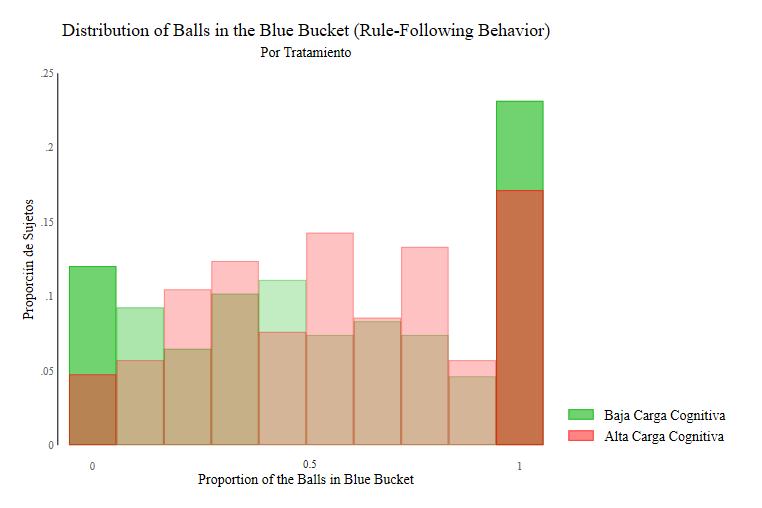

 # The Tired and The Blind, Effect of Cognitive Load Over Social Norms

## Description and motivation

Social norms are used to influence people's decision making. In fact, it is common to leverage the use of social norms in interventions that seek to generate positive outcomes on people's well-being such as binge drinking.  These interventions are based on the idea that behavior is influenced by perceptions of what is "normal" or "appropriate" behavior in a social context. For this reason, social norms can provide a powerful tool for influencing attitudes, intentions, and decision making.
Sometimes, what a person wants to do (e.g., buy ice cream) may clash with what social norms suggest (e.g., wait a certain amount of time in a line for ice cream). Therefore, in order to conform to social norms it is necessary to self-regulate, a concept that refers to the process of controlling thoughts and emotions. In these situations, the individual must exercise self-control to adhere his or her behavior to social norms, and this involves mental effort (Gailliot et al., 2012).

Recent studies have focused on the effect of context on perceptions of social behavior and the measurement of social norms (Krysowski and Tremewan, 2020; Bogliacino and Montealegre, 2020). For example, variables such as lack of rest, food restriction, and economic shocks have been shown to affect decision-making processes (Peng et al; Mani et al., 2013). In our research, "The Tired and the Blind. The effect of Cognitive Load over Social Norms" we explored cognitive load, a psychological mechanism that could explain the effect of situational variables on social norms. 
Cognitive load is a psychological concept that establishes a precise definition as the demand imposed on working memory. Working memory is a very important cognitive skill, responsible for the storage and use of short-term information. Increased demand on working memory (i.e., cognitive load) depletes cognitive resources that could be directed to the decision-making process. That is, being tired (having a lot of cognitive load) can influence how we follow a rule and our perception of it (decision making).

Cognitive load has been related to a trade-off between the dual systems theory proposed by Kahneman, (2011). This perspective proposes that different information-processing systems prioritize the production of automatic behaviors (system 1), and deliberate behaviors (system 2). System 2 involves effort and requires high cognitive resources.  Therefore, if cognitive resources are low due to an increase in cognitive load, the functioning of system 2 (related to rational decision making) decreases, leading to a predominance of system 1 (related to impulsive behaviors) which could conflict with normative behavior.

Project presentation in PDF (in Spanish) can be found [here](presentation/presentacion.pdf)

## Experimental Method

The experimental design consisted of: the Cognitive Reflection Test (CRT) followed by three incentivized tasks: (1) the N-back task; (2) the Rule-following propensity task; (3) the Krupka and Weber (2013) protocol to identify social norms (normative expectations) through coordination. We used a non-incentivized (4) variation of the KW protocol to obtaining the personal normative beliefs. We also used the NASA TLX task. We finished the experimental session with self-report measure about the cognitive load in the N-Back task, and a sociodemographic questionnaire

Our identification of the effects induced by a variation in cognitive load on norm-following behavior and social-norm perception relies on the com- parison of behavior for procedures 2-4 (as shown in Figure 1) following two different versions of the N-back task (1). We implement a version of the N-back task to elicit high cognitive load (henceforth, HCL), and a placebo version of the N-back (henceforth, LCL). We also varied the task order of normative expectations and personal normative beliefs.

### Classification Algorithm 

To classify individuals based on their perceived injunctive norms into Deontists and Consequentialists, \cite{aycinena_diego_social_2022} focus on the variation over the intensive margin. For each individual they elicited the social acceptability (SA) of 20 different possible reporting actions via the Krupka-Weber task.

They code each action as -1 (very socially inappropriate), -1/3 (somewhat socially inappropriate), + 1/3 (somewhat socially appropriate), and + 1 (very socially appropriate).

This allow them to estimate the following specification for each individual:

 $SA_{jis}$ = $\alpha$ + $\beta$ . $Extent_{j}$ + $\lambda$ . $Situations_{s}$ + $\delta$ . $Truths_{s}$ + $\varepsilon$

where $SA_{jis}$ denotes the social acceptability of situation s (there are 5 situations referring to each possible outcome of a non-payoff maximizing die roll) and j denotes the extent of a lie in reporting an outcome (i.e., whether a person advantageously over reports the die roll by one, two, etc... ). In the regression, they also controlled when they elicited perceived norms regarding truth telling.

Specifically, each individual is classified into types according to the following criteria:
-    Consequentialist type if $\beta$ < 0 (significant at least at the 10\% level), and the MSA of reporting a lie is lower than the MSA of reporting the truth while the mean social acceptability of reporting a lie is negative.

- Deontist type if $\beta$ = 0 (or not significantly different from zero at the 10\% level), the MSA of reporting the truth is greater zero, while the MSA of reporting a lie is negative.

- Normative Egoist type if $\beta$ > 0 (significant at least at the 10\% level) or $\beta$ = 0 and the MSA of reporting a lie is greater than the MSA of reporting the truth.

## Results 

### Compliance on the Treatment

The figure 1, show that subjects in the HCL condition had on average 43.2% fewer correct answers compared to subjects in the LCL condition. Interestingly, we observed that in the second and third round there is positive effect of the number of correct 

 

The figure 2  shows that subjects on the HCL condition have higher responses time by ≈ 300 ms. The subjects in the HCL condition had an average response time of 889 ms (SD = 595.9 ) while subjects in the LCL condition had a response time of 565 ms (SD = 205.9)

### Effects Over Rule Following Propensity

Figure 3 shows the distributions subjects in both \textit{LCL} and \textit{HCL} conditions according to their level of rule-following behavior (proportion of balls in the blue bucket). Both distributions have point masses at full rule-following and full rule-violation. We performed a Kolmogorov-Smirnov test to compare the ball distributions between the two treatments and found no significant differences between the two distributions (\textit{p-value} =  0.449). 

\begin{figure}[H]
  \centering
    \includegraphics[scale=0.45]{Imagenes/ProportionOver.png}
  \caption{Distribution of balls between Experimental Conditions }
  \label{fig.rule_following}
\end{figure}

Table \ref{tab.Azul} shows no significant effect of the \textit{HCL} condition on the propensity to follow rules (Column1). After observing the behavior of the distribution of balls between the two buckets, we decided to propose a series of exploratory analyses reported en columns 2, 3, 4  that would allow us to understand other relevant levels of propensity to follow the rules. 

|       &nbsp;        |   Rule Violation  | Complete Rule Foll |Complete Rule Break|Extreme Behavior|
|:-------------------:|:-----------------:|:------------------:|:---------------:|:------------------:|
|                     |                   |                    |                 |                    |
|    **Treatment**    |   2.039 (1.403)   |  -0.202 (0.198)    | -0.405* (0.262) | -0.134** (0.0626)   |
|                     |   -------------   |  ----------------  | --------------- |  ----------------- |
|  **Demographics**   |        Yes        |        Yes         |       Yes       |         Yes        |
| **_______________** |   _____________   |  ________________  | _______________ | __________________ |
|  **Observations**   |       213         |       213          |      213        |        213         |
|       **R2**        |       0.024       |       0.0176       |      0.061     |        0.045        |

We ran two Probit models: In the first one (column 2) the dependent variable was a dummy variable that took a value of 1 when subjects deposited all balls in the blue bucket (full rule-following), and in the second model (column 2) the dependent variable was a dummy that took a value of 1 when subjects left 0 balls in the blue bucket (full rule-violation).

	
For full rule-violation, we found that the \textit{HCL} treatment decreased the predicted probability of being a full rule-breaker. That means that people in the treatment group tended to put at least one ball in the blue bucket. This goes against our hypothesis (H1) but is consistent with \citep{adams-quackenbush_effects_2015}, who propose that deviating from the norm is cognitively challenging as it implies that people must later provide explanations and also, in some cases, must maintain a "straight" story.\footnote{ Also, \cite{strofer_catching_2016} found that in two groups in which one had an incentive to lie (not following the norm), subjects had differing skin conductance responses (SCR). Strofer proposed that not following the rules generates higher arousal levels as measured by SCR (and associated to higher levels of activity in the sympathetic nervous system).} Our results and this evidence support the hypothesis that subjects exposed to the \textit{HCL} condition and who consequently experience increased cognitive load prefer to follow the norm to avoid the additional cost of deviating from it.

Column 4 show the analysis of the effect of cognitive load on the distribution of blue balls in normative extreme behavior. For this purpose we created a dummy that took a value of 1 when the number of balls in the blue bucket was 0 or 50, and a value of 0 otherwise. In this case we found that people in the \texit{HCL} condition were 13\% less likely to have extreme behaviors. This result is quite interesting since there is not much evidence in this direction. \cite{westbrook_cognitive_2015}  proposed that increasing cognitive load through tasks that deplete self-control is related to changes in the salience of certain personality traits.\footnote{This means that certain traits may become salient but the reference point of the change is in the measure of the trait before to the experimental manipulation. This theory could explain the mixed results in the literature about the effect of lack of self-control over unethical behavioral and prosociality \citep{drolet_rationalizing_2004}} 

### Effects Over Social Norms Perception
The figure \ref{fig.tab_pers} show the results of the algorithm of classification for the Personal Normatives Beliefs, in the \textit{HCL} we classified 45\% of the subjects as Consequentialist, 38\% as Deontic. Also, we classified 7 \% as normative egoists. In the other hand in the \textit{LCL} we classified   51\% as Consequentialist, 38\% as Deontic . Finally, we classified 4 \% as Normative Egoists.

|       &nbsp;        | Consequensialist  |       Deontist     |Normative Egoist |      Other         |
|:-------------------:|:-----------------:|:------------------:|:---------------:|:------------------:|
|                     |                   |                    |                 |                    |
|    **Treatment**    |  0.0680 (0.0667)   | -0.128* (0.0678)   | -0.40           | -0.0643** (0.0310) |
|                     |   -------------   |  ----------------  | --------------- |  ----------------- |
|  **Demographics**   |        Yes        |        Yes         |       Yes       |         Yes        |
| **_______________** |   _____________   |  ________________  | _______________ | __________________ |
|  **Observations**   |       213         |       213          |      213        |        213         |
|       **R2**        |       0.047       |       0.017        |      0.061     |        0.332        |

Table 2 shows that there is an effect of it{HCL} on the distribution of the types for the personal normative beliefs perceptions.

The columns (4) shown that there is a higher probability of being in the Other category (i.e. subjects who have irregular behaviors or answer the same in all response options) in subjects exposed to the high cognitive load condition.

Also, the column (2)  shown that there is a significant effect on the Deontic category of norm perception. This negative effect means that Deontic subjects have lower probability of been found in the treatment group. These result is in line with the findings in Table \ref{tab.extreme}, where subjects in the high cognitive load treatment tend to have less extreme distributions on the Rule Following Propensity Task. 

 
 
