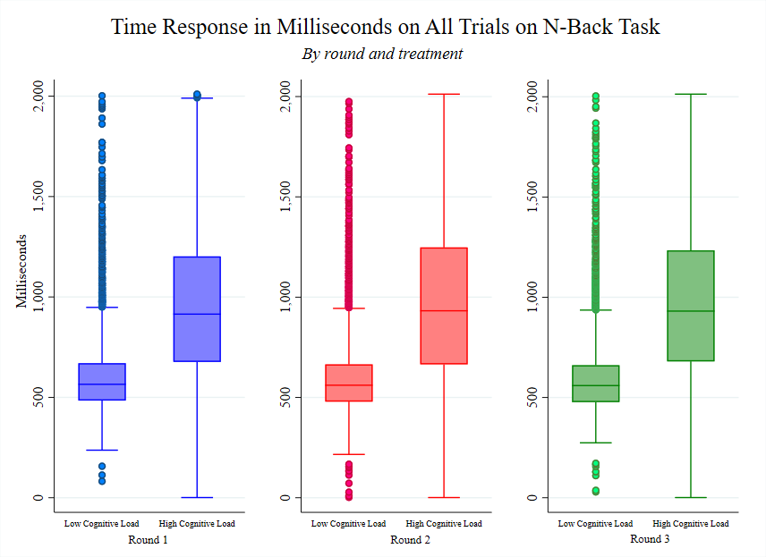
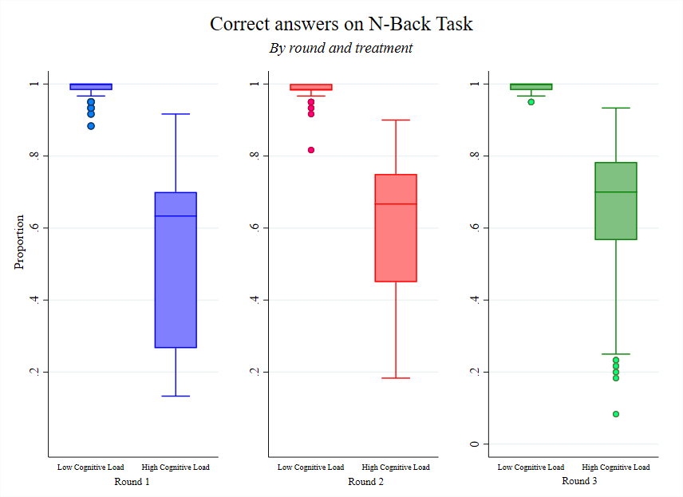

 # The Tired and The Blind, Effect of Cognitive Load Over Social Norms

## Description and motivation

Social norms are used to influence people's decision making. In fact, it is common to leverage the use of social norms in interventions that seek to generate positive outcomes on people's well-being such as binge drinking.  These interventions are based on the idea that behavior is influenced by perceptions of what is "normal" or "appropriate" behavior in a social context. For this reason, social norms can provide a powerful tool for influencing attitudes, intentions, and decision making.
Sometimes, what a person wants to do (e.g., buy ice cream) may clash with what social norms suggest (e.g., wait a certain amount of time in a line for ice cream). Therefore, in order to conform to social norms it is necessary to self-regulate, a concept that refers to the process of controlling thoughts and emotions. In these situations, the individual must exercise self-control to adhere his or her behavior to social norms, and this involves mental effort (Gailliot et al., 2012).

Recent studies have focused on the effect of context on perceptions of social behavior and the measurement of social norms (Krysowski and Tremewan, 2020; Bogliacino and Montealegre, 2020). For example, variables such as lack of rest, food restriction, and economic shocks have been shown to affect decision-making processes (Peng et al; Mani et al., 2013). In our research, "The Tired and the Blind. The effect of Cognitive Load over Social Norms" we explored cognitive load, a psychological mechanism that could explain the effect of situational variables on social norms. 
Cognitive load is a psychological concept that establishes a precise definition as the demand imposed on working memory. Working memory is a very important cognitive skill, responsible for the storage and use of short-term information. Increased demand on working memory (i.e., cognitive load) depletes cognitive resources that could be directed to the decision-making process. That is, being tired (having a lot of cognitive load) can influence how we follow a rule and our perception of it (decision making).

Cognitive load has been related to a trade-off between the dual systems theory proposed by Kahneman, (2011). This perspective proposes that different information-processing systems prioritize the production of automatic behaviors (system 1), and deliberate behaviors (system 2). System 2 involves effort and requires high cognitive resources.  Therefore, if cognitive resources are low due to an increase in cognitive load, the functioning of system 2 (related to rational decision making) decreases, leading to a predominance of system 1 (related to impulsive behaviors) which could conflict with normative behavior.

Project presentation in PDF (in Spanish) can be found [here](presentation/presentacion.pdf)

## Experimental Method

The experimental design consisted of: the Cognitive Reflection Test (CRT) followed by three incentivized tasks: (1) the N-back task; (2) the Rule-following propensity task; (3) the Krupka and Weber (2013) protocol to identify social norms (normative expectations) through coordination. We used a non-incentivized (4) variation of the KW protocol to obtaining the personal normative beliefs. We also used the NASA TLX task. We finished the experimental session with self-report measure about the cognitive load in the N-Back task, and a sociodemographic questionnaire

Our identification of the effects induced by a variation in cognitive load on norm-following behavior and social-norm perception relies on the com- parison of behavior for procedures 2-4 (as shown in Figure 1) following two different versions of the N-back task (1). We implement a version of the N-back task to elicit high cognitive load (henceforth, HCL), and a placebo version of the N-back (henceforth, LCL). We also varied the task order of normative expectations and personal normative beliefs.

##Results 

 
 
 
